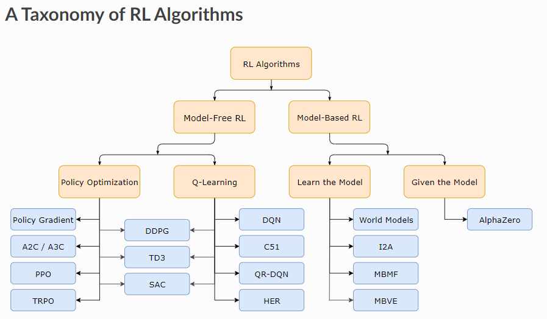

* this unordered seed list will be replaced by the toc 
{:toc}

In this project, Reinforcement learning algorithms like DQN and Q-learning are implemented on different environments using the Gymnasium API.
{: .lead}

Controlling robots has always been a hassle. If we know how our robot should move, then we can use any of the control algorithms available to achieve the desired robot motions. A classical example is a PID controller, which helps us follow a given trajectory, by constantly measuring the current state of the robot and applying corrective measures to match the expected state. But what can we do when we don't have a predefined trajectory or know how our robot should move. This is where optimal control techniques like Dynamic Programming and MPC help us to identify optimal behaviour a robot can have. But, wouldn't it be cool if the robot learns to move on it#s own by trial and error?

Reinforcement learning is a branch of AI, that allows an agent/robot to learn optimal behaviour through interaction with an environment providing constant feedback about the results of it's actions. Much of our work should go into setting up the environment, it's reward functions (the feedback), learning policies of the agent and so on and the robot will come up with a policy that gets the job done, by striving to maximize its rewards (or reduce it, if it is negative). There are several RL algorithms out of which we will only explore two of them. Below you can find a taxonomy of RL algorithms.    

Taxonomy of RL Algorithms from [Kaggle](https://www.kaggle.com/code/saquib7hussain/cartpole-game-reinforcement-learning#10.-Using-an-Alternate-Algorithm)
{:.figcaption}

In this project, the popular techniques of **Q-learning** and **Deep Q-learning** in RL are applied to solve some difficult control problems, demonstrating how RL comes up with optimal strategies without us having to hardcode it. The problems we are going to solve are

<ol>
  <li>make a underpowered mountain car learn to climb a hill</li>
  <li>make a cartpole learn to balance the poleendulum fixed on it</li>
  <li>make a double-pendulum stand upright against gravity and hold there for as long as possible</li>
</ol>

By applying these techniques to different control problems, we hope to see the extent until which these techniques are able to effectively solve the problems.

## Context and Problem Statement

In Reinfrocement learning, the problems we are hoping to solve, must be expressed in the form of an environment, with which the agent interacts and learns. An environment has the action-space (the actions that an agent can perform in the environment), the state-space (the states that an agent can be in) and the transistion dynamics (the dynamics governing the change from one state to another) well defined. The environments we will use for this project are,

<ol>
  <b><li>The Mountain Car Environment</li></b>
  The Mountain car is the simplest of the three problems. We have an underpowered car that is stuck in a valley between two steep hills. Even at full throtle, the car can't climb the hill as gravity always pulls the car down to the valley. If the car has any hope of climbing up the hill, then it must learn to use the potential energy by climbing the opposite hill and use it to climb the hill in front of it. 
   
  

  <b><li>The Cartpole Environment</li></b>
  A pole is attached to a cart using an unactuated joint and the cart can move along a fictionless track. The pole is placed in an upright position at start and our goal is to balance the pole by moving the cart to the left or right direction, for as long as possible.  
   
  

  <b><li>The Acrobot Environment</li></b>
  The Double Pendulum or Acrobot is a system that consists of two links connected linearly to form a chain. One end of the chain is fixed and the other joint between them is actuated. Our goal here is to learn to apply torque to the actuated link in a way that the free end of the chain swings above a certain height.  
   
  
</ol>

## Background

**Q-learning** is a model-free value-based reinforcement learning algorithm that allows an agent to learn optimal actions in a given environment through trial and error. It is a method for finding the best strategy to maximize long-term reward by learning from interactions with the environment. It is called model free because it doesn't need a model of the environment instead it learns by interacting with the environment. It learns to choose optimal actions by estimating so called Q-values, which are expected rewards of taking a specific action in a given state. Q-values are collected for different states in a table and later used to pick the action with the highest Q-value for any given state. It is categorized as an off-policy learning method because it can evaluate and update a policy that differs from the policy it used to take actions.

**Deep Q-learning** is an improvement to the Q-learning algorithm. The main difference to Q-learning is its use of neural networks to approximate the Q-value function. Q-learning can only be used for discreet states since it uses a table to record the states along with their associated q-values. If we wanted to use Q-learning on a continuous state space, then we need to discretize the state first. DQN overcomes this challenge by employing neural networks to learn the underlying Q-value function and can be also be used with continuous state space. We will look into DQN in detail [here]()

## Q-learning - Mountain car

In Q-learning, we learn Q-values of actions at different states. We will use Q-learning to solve the mountain car and cartpole environments. These two environemnts have the following properties

  

    <table>
      <thead>
        <tr>
          <th>Category</th>
          <th>Value</th>
        </tr>
      </thead>
      <tbody>
        <tr>
          <td>Action Space</td>
          <td>Discrete(3)</td>
        </tr>
        <tr>
          <td>Observation Shape</td>
          <td>(2,)</td>
        </tr>
        <tr>
          <td>Observation High</td>
          <td>[0.6 0.07]</td>
        </tr>
        <tr>
          <td>Observation Low</td>
          <td>[-1.2 -0.07]</td>
        </tr>
        <tr>
          <td>Import</td>
          <td><code>gym.make("MountainCar-v0")</code></td>
        </tr>
      </tbody>
    </table>
  

  

    <table>
      <thead>
        <tr>
          <th>Category</th>
          <th>Value</th>
        </tr>
      </thead>
      <tbody>
        <tr>
          <td>Action Space</td>
          <td>Discrete(2)</td>
        </tr>
        <tr>
          <td>Observation Shape</td>
          <td>(4,)</td>
        </tr>
        <tr>
          <td>Observation High</td>
          <td>[4.8 inf 0.42 inf]</td>
        </tr>
        <tr>
          <td>Observation Low</td>
          <td>[-4.8 -inf -0.42 -inf]</td>
        </tr>
        <tr>
          <td>Import</td>
          <td><code>gym.make("CartPole-v1")</code></td>
        </tr>
      </tbody>
    </table>
  

Properties of the mountain car and the cartpole environment
{:.figcaption}

The action space of these environments are discrete, meaning we can either move the car/cart to the right or left at a set velocity or not apply any velocity at all. The observation space is the amount of information that we will receive from our environment like the position and velocity of the car, position and velocity of the pendulum. Below, we will look into the algorithm and the implementation in detail.

### Algorithm

The Q-learning algorithm is as follows

<ol>
  <li>Setup the environment, so that we are able to receive observations and perform actions</li>
  <li>Setup hyperparameters like learning rate, discount factor, epsilon (exploration/exploitation tradeoff) etc., </li>
  <li>Discretize the observation space of the environement</li>
  <li>Initialize Q-table and other storage variables</li>
  <li>Setup the training loop</li>
  <li>Run inference</li>
</ol>

### The Environment

**[Gymnasium](https://gymnasium.farama.org/index.html)** is based on the OpenAI Gym library which has a lot of reference environments and provides us with APIs to facilitate communication between the algorithms and the environment. In this project we use the [MountainCar-v0](https://gymnasium.farama.org/environments/classic_control/mountain_car/) and the [CartPole-v1](https://gymnasium.farama.org/environments/classic_control/cart_pole/) environments.

To use these environments, we first have to initialize them

~~~py
import gymnasium as gym

env = gym.make("CartPole-v1")     # or MountainCar-v0
obs, info = env.reset()           # Resets the environment
~~~

### Hyperparameters

There are some hyperparameters that we need to set before beginning our training process. These hyperparameters have great influence on the success of our agent. The hyperparameters used in this project are

  <table>
    <thead>
      <tr>
        <th>#</th>
        <th>Hyperparameter</th>
        <th>Description</th>
        <th>Value</th>
      </tr>
    </thead>
    <tbody>
      <tr>
        <td>1</td>
        <td>learning rate</td>
        <td>Decides how fast the agent will learn from examples</td>
        <td>0.9</td>
      </tr>
      <tr>
        <td>2</td>
        <td>discount factor</td>
        <td>Decides whether to value short term rewards or long term rewards</td>
        <td>0.9</td>
      </tr>
      <tr>
        <td>3</td>
        <td>epsilon decay</td>
        <td>Decides the rate at which exploration becomes exploitation</td>
        <td>$$\frac{2}{\text{total episodes}}$$</td>
      </tr>
    </tbody>
  </table>

For our agent to learn an optimal policy, we must allow our agent to explore enough before making use of the learned q-values. So, we use a policy called $$\epsilon$$-greedy policy, where $$\epsilon$$ decides if we are going to choose a random action (to explore) or to choose a value from our q-table (exploit what we have learned). The value we have chosen makes sure that we explore for the half of the total episodes before exploiting what we have learned.

### Discretization

During our training, we will be constantly interacting with our environment, recording the state and the associated q-values in our q-table. The environment provides continuous values for the current position of the mountain car. Since it is not feasible to record all the position values in a q-table, we will discretize the continuous variables from the environement before storing it. We will also initialize a q-table containing q-values for each state and action, which will be updated during our training process.

### Training

Training will be done for a given number of episodes. At the start of each episode, the mountain car is spawned at a random location at the valley between the hills. Based on our learning policy, we will choose a random action within the action space or the action with the highest q-value for the given state. Then based on the rewards received, we will calculate the q-values associated with that state and action based on the following rule

$$ 
Qvalue[current\;state, current\;action] = Qvalue[current\;state, current\;action] + learning\;rate * ( reward + discount\;factor * max(Qvalue[current\;state,:]) - Qvalue[current\;state, current\;action]) 
$$

The episode will run until one of the following two conditions are met.
<ul>
  <li>Termination - The goal has been reached</li>
  <li>Truncation - The episode is ended when the episode length is over 200</li>
</ul>
After each episode, the $\epsilon$ value is reduced by the $\epsilon$-decay factor to facilitate switch from exploration and exploitation.

### Result

After training from 5000 episodes after rejecting negative rewards over 1000, this is how our mountain car performs    



## Discussion

We can see that the car has learned well to make use of the potential energy to overcome it's lack of engine power and climb the hill in front of it. Although it is able to finish the task, there is still room for improvement. From the overall rewards gained throughout training, it is evident that the car can't climb the hill faster than 200 timesteps. There is probably no need to climb the opposite hill all the way up for that. Next steps would be to optimize this behaviour of the car.



The algorithm for the cartpole environment is similar except there are two more states to keep track of and the truncation and termination rules for the cartpole environment is different.

*[MPC]: Model Predictive Control
*[RL]: Reinforcement Learning